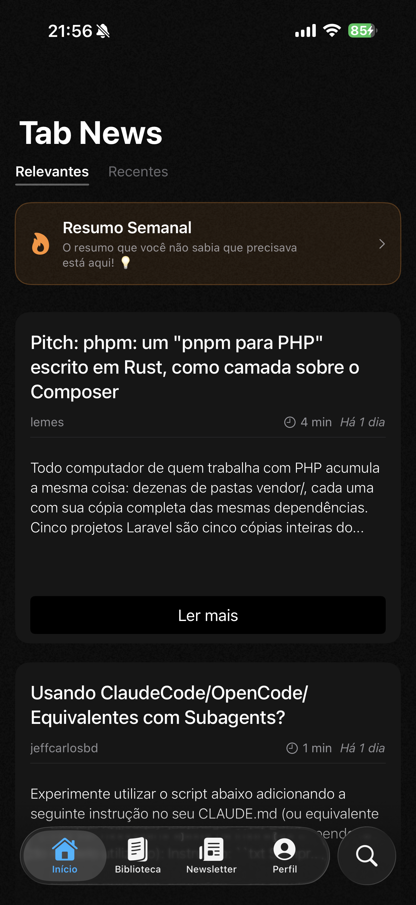
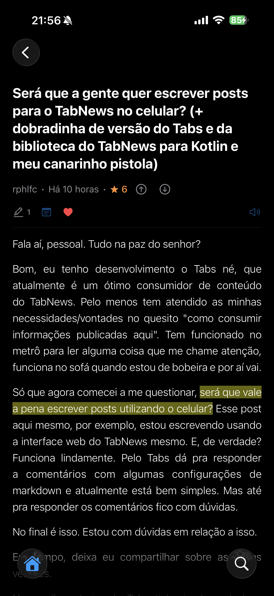
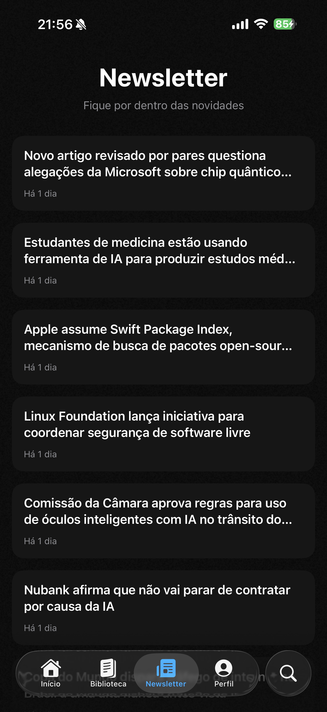
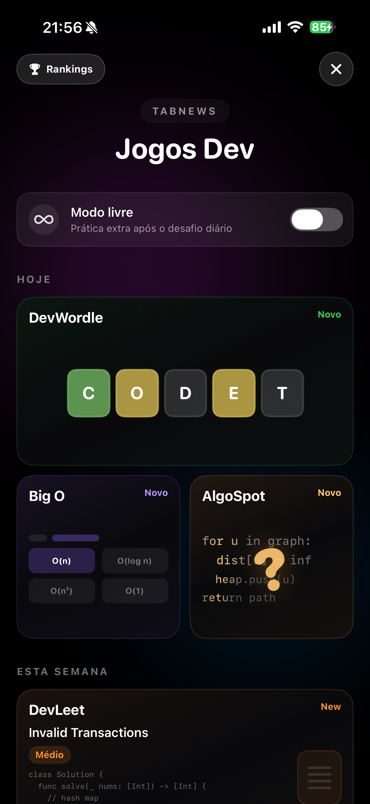
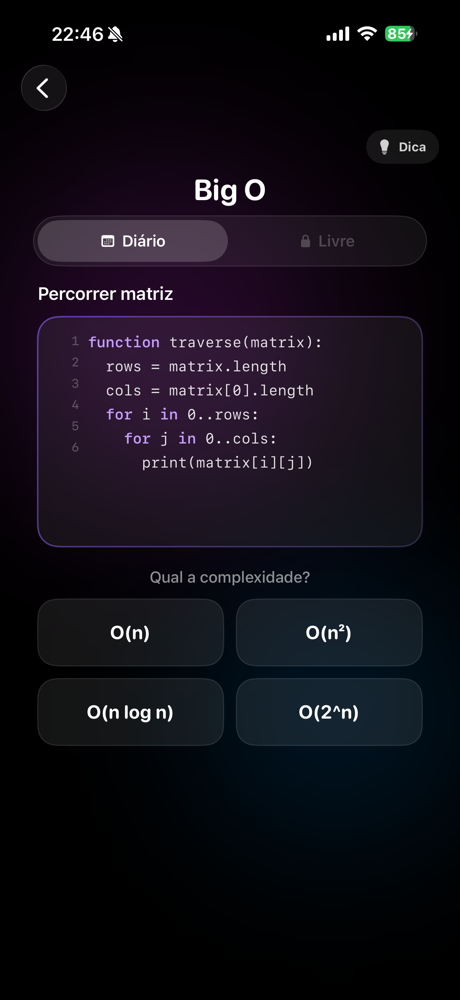
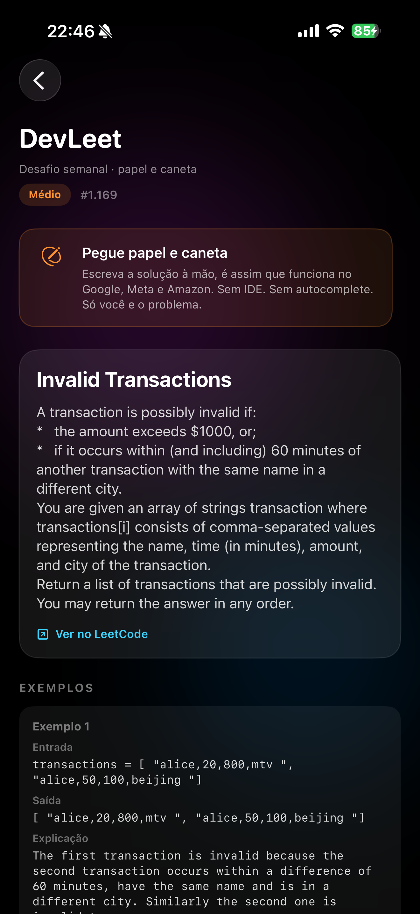

# TabNews Reader

An unofficial iOS client for [TabNews](https://www.tabnews.com.br), a Brazilian tech community where developers publish posts, debate in comments, and earn reputation through _tabcoins_. Think Hacker News or Reddit, but focused on engineering culture in Portuguese.

This app started as a better way to read TabNews on the phone. It grew into a full client: library tools, digests, widgets, Apple Watch, push notifications, and a set of mini-games I built for breaks between articles.

**[Download on the App Store](https://apps.apple.com/app/id6755933359)** · fan-made, not affiliated with TabNews

## Screenshots

| Home feed                                                              | Post reader                                                               |
| ---------------------------------------------------------------------- | ------------------------------------------------------------------------- |
|  |  |

| Newsletter                                              | Dev Games hub                                    |
| ------------------------------------------------------- | ------------------------------------------------ |
|  |  |

| Big O                                                    | DevLeet                                                                |
| -------------------------------------------------------- | ---------------------------------------------------------------------- |
|  |  |

---

## Context

If you're outside Brazil, TabNews probably won't ring a bell. That's the point of this README.

TabNews is a public platform for long-form technical writing and discussion. Posts rank by community votes (_tabcoins_). There's a weekly newsletter, community digests, and a comment culture that's closer to a dev forum than a news feed. The official site works well in Safari; this project asks what a native iOS experience could add on top of that.

---

## What the app actually does

### Feed & reading

The home feed pulls live content from the TabNews API. You can switch sorting strategies (recent, relevant, and more), open posts in a native reader with Markdown rendering, listen via text-to-speech, and jump to the original page when you want the full web context.

Comments load in-thread with reply support and a compose flow that handles Markdown formatting.

### Library

Reading on mobile only works if you can save things. The library tab holds liked posts, highlights, notes, custom folders, and a read-later queue, all persisted locally with SwiftData. Highlights are tied to text selections inside the post body; notes attach to specific articles.

### Newsletter & digests

TabNews runs a newsletter and the community produces weekly digests (curated roundups of the best posts). The app has dedicated surfaces for both, with unread badges and push notification hooks so you don't have to remember to check.

### Search & Discover

Search goes beyond a text field: query parsing, filters, and a Discover section for browsing promoted or editorial content without knowing exactly what you're looking for.

### Dev Games

Between reading sessions, there's a hub of small games aimed at developers. Not a separate app bolted on; same idea as the rest of the product: rest your eyes, keep your brain on.

- **DevWordle**: five-letter dev vocabulary, daily + free mode
- **DevLeet**: describe-the-algorithm puzzles
- **DevSpot**: spot the odd word out
- **Big O** / **AlgoSpot**: identify complexity or name the algorithm from code snippets
- **Color Match** / **Sound Match**: arcade-style perception games with HSL sliders and a synthesized tone ribbon

Daily challenges, free practice after completing the daily run, Game Center leaderboards, and achievements for Wordle/Leet progress. Badges and weekly challenges tie game activity back into the main gamification layer.

### Beyond the phone

**Widgets** (small / medium / large) show recent posts, top relevant posts, and the weekly digest on the Home Screen, with deep links back into the app (`tabnews://post/...`, `tabnews://digest`, etc.).

**Apple Watch** companion app for glancing at posts and synced library state via App Groups + WatchConnectivity.

**Push notifications** through Firebase Cloud Messaging for newsletter and digest alerts.

---

## Stack

| Layer           | Choices                                                                  |
| --------------- | ------------------------------------------------------------------------ |
| UI              | SwiftUI, iOS 26+                                                         |
| Local data      | SwiftData                                                                |
| Networking      | async/await, custom API client against TabNews                           |
| Auth            | native login + web session fallback, Keychain for tokens                 |
| Push            | Firebase (FCM + APNs)                                                    |
| Games audio     | AVAudioEngine oscillator (`ToneGenerator`)                               |
| Games social    | GameKit (leaderboards & achievements)                                    |
| Widgets / Watch | WidgetKit, watchOS, shared App Group `group.tabnews.com.app.tabnews-ios` |

No storyboards. The app target, widget extension, and watch app live in one Xcode project under `newtabnews/`.

---

## Project layout

```
tabnews-app/
└── newtabnews/
    ├── newtabnews.xcodeproj
    ├── newtabnews/              # main iOS app
    │   ├── App/                 # entry, tabs, deep links
    │   ├── Core/                # views, services, view models
    │   ├── Models/
    │   ├── Network/
    │   └── Notifications/
    ├── TabNewsWidgets/          # Home Screen widgets
    ├── TabNews Watch Watch App/
    └── Scripts/                 # content audits, push test helpers
```

Rest game content (Wordle word lists, Big O / AlgoSpot challenge pools) lives as JSON in the repo and is validated with small Node scripts in `Scripts/`.

---

## Running locally

**Requirements:** Xcode 26+, iOS 26 simulator or device.

```bash
git clone https://github.com/luizmellodev/tabnews.app.git
cd tabnews-app/newtabnews
open newtabnews.xcodeproj
```

Select the **newtabnews** scheme and run.

### Firebase (push notifications)

`GoogleService-Info.plist` is gitignored. To test push locally, add your own plist from the Firebase console into the `newtabnews/` target. The app runs without it. Feeds, library, and games work; only remote push registration won't.

### Game Center

Leaderboards and achievements use IDs prefixed with `tabnews.*` in App Store Connect. Sandbox testing requires a Game Center account on the device/simulator.

---

## Deep links

| URL                             | Opens          |
| ------------------------------- | -------------- |
| `tabnews://home`                | Home feed      |
| `tabnews://newsletter`          | Newsletter tab |
| `tabnews://digest`              | Digest sheet   |
| `tabnews://post/{owner}/{slug}` | Specific post  |

Used by widgets, notifications, and external shortcuts.

---

## Open source

This repo is public on purpose. Spotted a bug? Want a feature the App Store build doesn't have yet? **Open a PR.** Fixes, polish, and small additions are all fair game.

You don't need permission for drive-by fixes. For bigger changes (new screens, API behavior, game content overhauls), open an issue first so we don't duplicate work.

### How to contribute

1. Fork the repo and clone your fork.
2. Create a branch off `main` (`fix/comment-crash`, `feat/watch-complication`, whatever describes it).
3. Open `newtabnews/newtabnews.xcodeproj` in Xcode and run the **newtabnews** scheme.
4. Make the change. Keep PRs focused: one thing at a time is easier to review than a kitchen-sink diff.
5. Push and open a pull request against `main`. Describe what changed and how you tested it (simulator, device, which flow).

### A few practical notes

- **Secrets stay out of git.** `GoogleService-Info.plist`, APNs `.p8` keys, and similar files are gitignored. Never commit them.
- **Rest game JSON** lives under `Core/Views/RestGames/`. If you edit Big O or AlgoSpot pools, run `node newtabnews/Scripts/audit-rest-games-pools.mjs` before opening the PR.
- **Match what's already there.** SwiftUI patterns, naming, and file layout in the repo are the style guide. No need for a formal doc; read the surrounding code.
- **Firebase / Game Center / push** are optional for most contributions. You can fix UI, reading flow, or games without configuring either.

Questions or half-baked ideas are fine in issues. If you're not sure whether something fits, ask there before spending a weekend on it.

---

## Status & disclaimer

Live on the App Store, actively maintained. This is a **fan project**, not official and not endorsed by the TabNews team. API usage respects the public TabNews endpoints; if you're building something similar, read their terms and be a good citizen.

---

**Luiz Mello** · [github.com/luizmellodev](https://github.com/luizmellodev)
